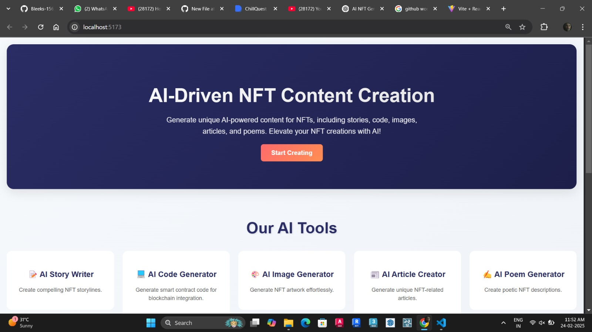

# 🎨 AI-Content-Generated NFT  

  

## ✨ Features  

- **AI-Generated NFTs** – Create unique NFTs through AI-powered content generation.  
- **Smart Contract Integration** – Developed with **Foundry** for contract management.  
- **IPFS Storage** – Securely store AI-generated content with **decentralized storage**.  
- **MetaMask Authentication** – Seamless blockchain interactions.  
- **ERC-721 Standard** – NFTs follow the **ERC-721** minting standard.  

## 🛠 Tech Stack  

- **Solidity** – Smart contract development  
- **Foundry** – Ethereum development framework  
- **React.js** – Frontend interface  
- **Ethers.js** – Blockchain interactions  
- **IPFS/Pinata** – Decentralized storage  
- **MetaMask** – Wallet authentication  

## 🔥 Foundry Components  

- **Forge** – Ethereum testing framework  
- **Cast** – Interact with smart contracts and blockchain data  
- **Anvil** – Local Ethereum node  
- **Chisel** – Solidity REPL  

## 📜 Documentation  

📖 [Foundry Docs](https://book.getfoundry.sh/)  

## 🛠 Usage  

### 🏗 Build  
```shell
forge build
